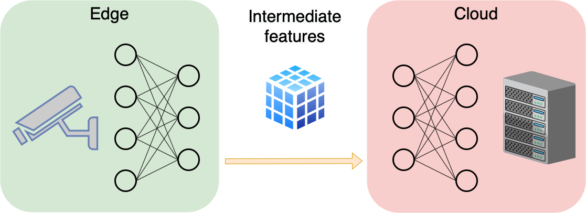

## ColliFlow: A Library for Executing Collaborative Intelligence Graphs

*NeurIPS 2020 demo.*

<b><a href="https://www.dropbox.com/s/j7y8j77uju5pcor/neurips_demo_2020_abstract.pdf?dl=1">Abstract (PDF)</a></b>

Collaborative intelligence is a technique for using more than one computing device to perform a computational task.
A possible application of this technique is to assist mobile client edge devices in performing inference of deep learning models by sharing the workload with a server.
In one typical setup, the mobile device performs a partial inference of the model, up to an intermediate layer.
The output tensor of this intermediate layer is then transmitted over a network (e.g. WiFi, LTE, 3G) to a server, which completes the remaining inference, and then transmits the result back to the client.
Such a strategy can reduce network usage, resulting in reduced bandwidth costs, lower energy consumption, faster inference, and provide better privacy guarantees.
A working implementation of this was shown in our demo at NeurIPS 2019.
This year, we present a library that will enable researchers and developers to create collaborative intelligence systems themselves quickly and easily.

This demo presents a new library for developing and deploying collaborative intelligence systems.
Computational and communication subprocesses are expressed as a directed acyclic graph.
Expressing the entire process as a computational graph provides several advantages including 
modularity,
graph serializability and transmission,
and easier scheduling and optimization.

Library features include:

 - Graph definition via a functional API inspired by Keras and PyTorch
 - Over-the-network execution of graphs that span across multiple devices
 - API for Android (Kotlin/Java) edge clients and servers (Python)
 - Integration with Reactive Extensions (Rx)
<!--  - Optimal scheduling for low latency and high throughput -->
 - Asynchronous execution and multi-threading support
 - Backpressure handling
 - Modules for network transmission of compressed feature tensor data

Library source code and complete examples will be made available at
<b><a href="https://github.com/YodaEmbedding/colliflow">this GitHub repository</a></b>
in the coming weeks.
Please bookmark to stay tuned!

 

 

<iframe width="800" height="600" src="https://www.youtube.com/embed/sHySFCUzh6s" frameborder="0" allow="accelerometer; autoplay; clipboard-write; encrypted-media; gyroscope; picture-in-picture" allowfullscreen></iframe>

 

 

<!--
 
 

<b>NOTE: Live demo will be made public at demo time (8 PM PST).</b>

 
 
 
-->

 
 
 
 
